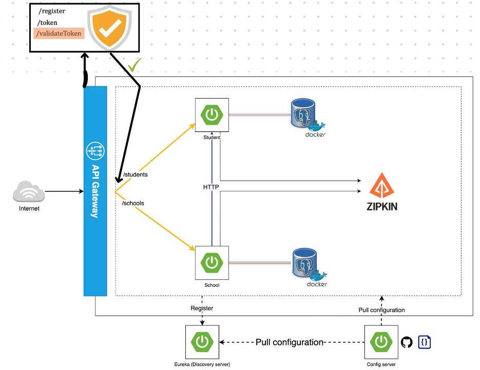

# Microservices Demo de Registro de Colegios y Estudiantes



Este repositorio contiene un proyecto de demostración que muestra una aplicación basada en microservicios, diseñada para brindar una comprensión práctica de la arquitectura e implementación de microservicios. El proyecto se compone de varios componentes, incluyendo una Pasarela de API, un Servidor de Configuración, un Servidor de Descubrimiento, un Servidor de Seguridad y dos microservicios: Student (Estudiante) y School (Escuela).

## Índice

- [Cómo empezar](#primeros-pasos)
  - [Requisitos previos](#pre-requisitos)
  - [Instalación](#instalacion)
- [Componentes del proyecto](#componentes-del-proyecto)
  - [Pasarela API](#pasarela-api)
  - [Servidor de configuración](#servidor-de-configuración)
  - [Servidor de descubrimiento](#discovery-server)
  - [Servidor de seguridad](#servidor-de-seguridad)
  - [Microservicio de estudiantes](#microservicio-de-estudiantes)
  - [Microservicio escolar](#microservicio-de-escuela)
- [Comunicación entre servicios](#comunicación-entre-servicios)
  - [Uso de OpenFeign](#uso-de-openfeign)
- [Rastreo distribuido](#rastreo-distribuido)
  - [Uso de Zipkin](#usando-zipkin)
- [Licencia](#licencia)
- [Contacto](#contacto)
- [Agradecimientos](#agradecimientos)

## Primeros Pasos

Siga las siguientes instrucciones para configurar el proyecto en su máquina local con fines de desarrollo y prueba.

### Pre-requisitos

Asegúrese de tener instalado el siguiente software en su sistema antes de continuar:

- Java Development Kit (JDK) 17 o posterior
- Maven
- Docker (opcional, para la contenedorización)

### Instalacion

1. Clone el repositorio:

```git clone https://github.com/ZenyCero/Colege-Microservice.git```

2. Navega al directorio del proyecto:
3. Construye y empaqueta cada componente con Maven:


## Componentes del proyecto

### Pasarela API

El API Gateway sirve como único punto de entrada para todas las peticiones de los clientes, gestionándolas y dirigiéndolas a los microservicios apropiados.

### Servidor de configuración

El Config Server centraliza la gestión de la configuración de todos los microservicios, simplificando el mantenimiento de la aplicación y la coherencia entre entornos.

### Discovery Server

El Discovery Server proporciona registro y descubrimiento de servicios, permitiendo una comunicación fluida de servicio a servicio dentro del ecosistema de microservicios.

### Servidor de seguridad

El servidor de seguridad proporciona mecanismos para garantizar la seguridad de la API, como el filtrado de solicitudes y la validación de tokens.

### Microservicio de estudiantes

El microservicio de estudiantes se encarga de gestionar los datos y operaciones relacionados con los estudiantes, como añadir, actualizar y recuperar registros de estudiantes.

### Microservicio de escuela

El microservicio de escuela se encarga de gestionar los datos y operaciones relacionados con la escuela, como añadir, actualizar y recuperar registros de escuelas.

### Comunicación entre servicios

### Uso de OpenFeign

Este proyecto demuestra la comunicación entre servicios utilizando OpenFeign, un cliente REST declarativo que simplifica la comunicación de servicio a servicio dentro del ecosistema de microservicios.

## Rastreo Distribuido

### Usando Zipkin

El proyecto muestra el uso de Zipkin para el rastreo distribuido, mejorando la observabilidad de la aplicación y permitiendo la visualización y solución de problemas de latencia.

## Licencia

Este proyecto está licenciado bajo la [Licencia MIT](LICENSE).

## Contacto

[Elias Tagle] - [eliastzv@hotmail.com]

Enlace del proyecto: https://github.com/ZenyCero/Colege-Microservice.git

## Agradecimientos

- [OpenFeign](https://github.com/OpenFeign/feign)
- [Zipkin](https://zipkin.io/)
- [Spring Cloud Netflix](https://spring.io/projects/spring-cloud-netflix)
- [Spring Security](https://spring.io/projects/spring-security)
